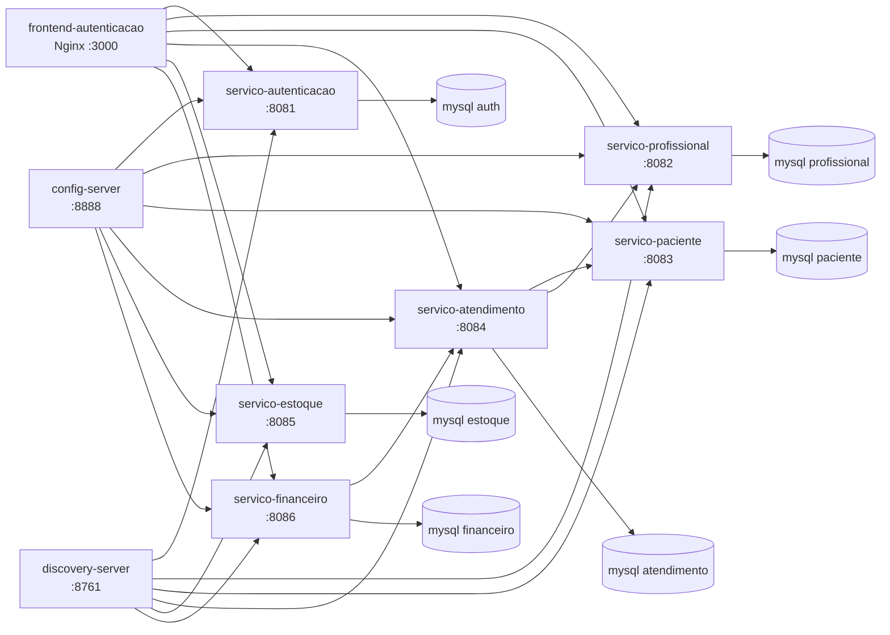

# Clinica Odontologica - Backend

Sistema de gestao para clinica odontologica usando arquitetura de microsservicos com Spring Boot, MySQL, Docker Compose, Eureka, Config Server e frontend estatico servido por Nginx.

## Modulos

| Modulo | Porta | Responsabilidade |
| --- | ---: | --- |
| `config-server` | 8888 | Centraliza configuracoes via Spring Cloud Config |
| `discovery-server` | 8761 | Service discovery com Eureka |
| `servico-autenticacao` | 8081 | Login, setup inicial, usuarios e emissao de JWT |
| `servico-profissional` | 8082 | Cadastro, consulta e filtros de profissionais |
| `servico-paciente` | 8083 | Cadastro, consulta e filtros de pacientes |
| `servico-atendimento` | 8084 | Agendamento, listagem, realizacao e cancelamento de atendimentos |
| `servico-estoque` | 8085 | Materiais, saldo, baixo estoque e movimentacoes |
| `servico-financeiro` | 8086 | Receitas, despesas e relatorio financeiro por periodo |
| `frontend-autenticacao` | 3000 | Dashboard estatico com autenticacao e telas operacionais |

## Arquitetura



## Como subir localmente

Crie um arquivo `.env` na raiz com as variaveis necessarias:

```env
GIT_USERNAME=seu_usuario
GIT_TOKEN=seu_token
JWT_SECRET=desenvolvimento-local-chave-minima-32-chars
ADMIN_SENHA_GERENTE=senha
ADMIN_SENHA_ATENDENTE=senha
ADMIN_SENHA_DENTISTA=senha
ADMIN_SENHA_AUXILIAR=senha
```

Suba o ambiente completo:

```powershell
docker compose up --build
```

Acesse:

| Recurso | URL |
| --- | --- |
| Frontend | http://localhost:3000 |
| Eureka | http://localhost:8761 |
| Auth health | http://localhost:8081/auth/health |
| Atendimento health | http://localhost:8084/atendimentos/health |
| Estoque health | http://localhost:8085/estoque/health |
| Financeiro health | http://localhost:8086/financeiro/health |

## Ordem esperada dos servicos

1. Bancos MySQL
2. `config-server`
3. `discovery-server`
4. `servico-autenticacao`
5. `servico-profissional`
6. `servico-paciente`
7. `servico-atendimento`
8. `servico-estoque`
9. `servico-financeiro`
10. `frontend-autenticacao`

## Testes

Rodar todos os testes pela raiz:

```powershell
mvn clean test
```

Rodar um modulo especifico:

```powershell
mvn -q -pl servico-atendimento test
mvn -q -pl servico-estoque test
mvn -q -pl servico-financeiro test
```

Rodar dentro do modulo:

```powershell
cd servico-financeiro
mvn -q test
```

## APIs principais

| Dominio | Endpoints principais | Documentacao |
| --- | --- | --- |
| Autenticacao | `POST /auth/login`, `POST /auth/setup`, `GET /auth/health` | README do servico |
| Profissionais | `GET /profissionais`, `GET /profissionais/me` | README do servico |
| Pacientes | `GET /pacientes` | README do servico |
| Atendimentos | `GET /atendimentos`, `POST /atendimentos`, `PATCH /atendimentos/{id}/status` | [docs/servico-atendimento-api.md](docs/servico-atendimento-api.md) |
| Estoque | `GET /materiais`, `POST /materiais`, `POST /materiais/{id}/movimentacoes` | [docs/servico-estoque-api.md](docs/servico-estoque-api.md) |
| Financeiro | `GET /receitas`, `POST /receitas`, `GET /relatorios/financeiro` | [docs/servico-financeiro-api.md](docs/servico-financeiro-api.md) |

## Seguranca

Os servicos de dominio usam JWT no header:

```http
Authorization: Bearer <token>
```

Perfis atuais:

```text
GERENTE | ATENDENTE | DENTISTA | AUXILIAR
```

Regras principais:

- `GERENTE`: acesso administrativo amplo aos modulos.
- `ATENDENTE`: opera pacientes, atendimentos e receitas.
- `DENTISTA`: visualiza seus proprios atendimentos e consulta dados permitidos.
- `AUXILIAR`: opera estoque e consulta dados permitidos.

## Documentacao e Postman

- Guia da API de atendimento: [docs/servico-atendimento-api.md](docs/servico-atendimento-api.md)
- Guia da API de estoque: [docs/servico-estoque-api.md](docs/servico-estoque-api.md)
- Guia da API financeira: [docs/servico-financeiro-api.md](docs/servico-financeiro-api.md)
- Colecao Postman de atendimento: [docs/servico-atendimento.postman_collection.json](docs/servico-atendimento.postman_collection.json)

## Entrega final da Sprint 4

A Sprint 4 entrega o sistema com os modulos de autenticacao, profissionais, pacientes, atendimentos, estoque, financeiro e frontend integrados via Docker Compose. O fluxo esperado para validacao final e:

1. Subir o ambiente com `docker compose up --build`.
2. Fazer login pelo frontend em `http://localhost:3000`.
3. Validar cadastro/consulta de pacientes e profissionais.
4. Validar criacao de atendimentos respeitando duracao e conflitos de agenda.
5. Validar cadastro de materiais, movimentacoes e alerta de baixo estoque.
6. Validar receitas vinculadas a atendimentos, despesas e relatorio financeiro por periodo.
7. Rodar `mvn clean test` pela raiz antes da entrega.